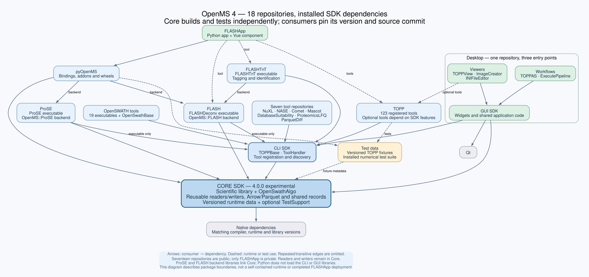

# OpenMS ProSE

ProSE is a separately packaged peptide search engine. It provides the shared
`OpenMS::ProSE` backend for C++ and pyOpenMS and an optional `ProSE` executable.
The backend uses an installed, exactly pinned Core SDK. File formats, chemistry,
FragmentIndex and shared identification/scoring primitives remain in Core.

Configure after the dependency commits in `dependencies.lock.json` are installed:

```sh
cmake -S . -B build -DCMAKE_BUILD_TYPE=Debug -DCMAKE_PREFIX_PATH=/path/to/sdk
cmake --build build --parallel 2
ctest --test-dir build --output-on-failure
cmake --install build --prefix /path/to/sdk
```

Use `-DOPENMS_PROSE_BUILD_TOOL=OFF` for a backend-only build; it needs no CLI SDK.
Use `-DBUILD_TESTING=OFF` when the installed Core omits TestSupport. Published
builds additionally use `-DOPENMS4_REQUIRE_CLEAN_SOURCE=ON`. Keep the same supported
compiler, architecture and configuration as Core. Canonical source guards reject
changed source identity until the build is reconfigured.

An external consumer uses:

```cmake
find_package(OpenMSProSE 1.0.0 EXACT CONFIG REQUIRED)
target_link_libraries(my_application PRIVATE OpenMS::ProSE)
```

The header remains `OpenMS/ANALYSIS/ID/ProSEAlgorithm.h`. The package exports its
own source revision/dirty metadata and `OpenMSProSE_CORE_SOURCE_REVISION`; its
config rejects a different Core revision. pyOpenMS retains its existing bindings
and must link/package this backend, with its own exact source pin.

`ProSEAlgorithm_test` preserves the former Core tests, including synthetic search,
FDR, calibration and modification-analysis checks. `ProSEBrukerTims_test` preserves
the engine-dependent section formerly in Core's Bruker reader test. It is registered
only with an Opentims-enabled SDK plus both `OPENTIMS_DDA_TEST_DATA` (a real `.d`
directory) and `OPENTIMS_TEST_FASTA`. Missing fixtures do not produce a passing
placeholder. Reader-only assertions stay in Core. TestData retains shared TOPP
input/output fixtures; owning this engine does not make those files private.

```sh
python3 -m unittest discover -s tests -p 'test_*.py' -v
cmake -S tests/installed_sdk -B build-consumer -DCMAKE_PREFIX_PATH=/path/to/sdk
cmake --build build-consumer --parallel 2
ctest --test-dir build-consumer --output-on-failure
```

See the [parent validation report](https://github.com/okohlbacher/OpenMS4-tests/blob/codex/package-split/docs/tool-backend-validation.md)
for exact native profiles and results, including the reduced Core build, product
tests, installed consumer and Python wheel. `migration-manifest.json` records the original commits, file hashes and
the precise Bruker test split; no generic file-format implementation is moved.

<!-- package-graph:begin -->
## Where this package sits



`prose` builds against the installed **core**, **cli**, **test-data** packages at the revisions recorded in [`dependencies.lock.json`](dependencies.lock.json). **pyopenms** builds against it.

| Repository | Relation | Contents |
| --- | --- | --- |
| [OpenMS4-core](https://github.com/okohlbacher/OpenMS4-core) | dependency | scientific library, OpenSwathAlgo, readers and writers, runtime data, optional TestSupport |
| [OpenMS4-cli](https://github.com/okohlbacher/OpenMS4-cli) | dependency | TOPPBase, tool registration and discovery |
| [OpenMS4-test-data](https://github.com/okohlbacher/OpenMS4-test-data) | dependency | versioned fixtures and the installed numerical suite |
| [OpenMS4-pyopenms](https://github.com/okohlbacher/OpenMS4-pyopenms) | consumer | nanobind bindings, installed module tree and repaired wheels |

The eighteen repositories are assembled by the parent repository
[OpenMS4-tests](https://github.com/okohlbacher/OpenMS4-tests), which holds the submodule pins (`packages.lock.json`), the
dependency-order build runner and the contract tests that keep the graph consistent.
[`docs/project-state.md`](https://github.com/okohlbacher/OpenMS4-tests/blob/codex/package-split/docs/project-state.md) is the current state
of the whole project; [`docs/build-split-packages.md`](https://github.com/okohlbacher/OpenMS4-tests/blob/codex/package-split/docs/build-split-packages.md)
reproduces the installed-SDK build.
<!-- package-graph:end -->
